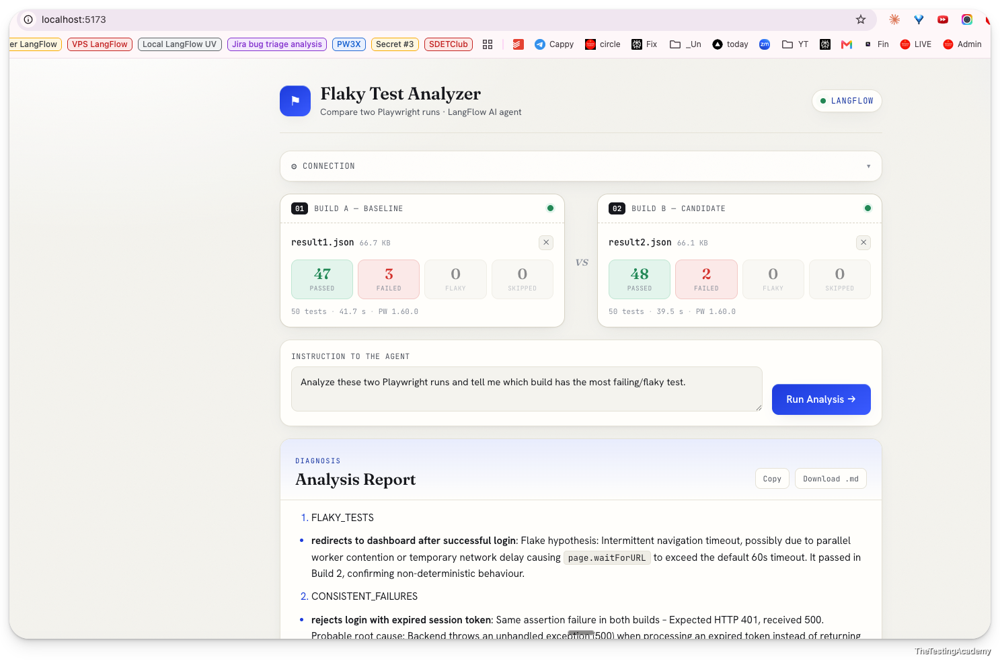

# Chapter 05 — AI Agents with LangFlow

### What Is LangFlow?

LangFlow is a visual, low-code builder for LLM apps and AI agents. You wire components
(models, prompts, tools, file loaders, parsers) on a canvas, test the flow live, and then
expose it as an HTTP API. Every published flow gets a REST endpoint
(`POST /api/v1/run/{flowId}`) so any front-end — or a CI job — can call it.

This chapter builds real QA agents on top of that API:

1. **Flaky Test Analyzer** — compares two Playwright runs, with a React UI.
2. **API Contract Validator** — fetches a live endpoint and validates the response against a JSON schema.

---

## Flaky Test Analyzer (AI Agent)

A LangFlow agent that ingests **two Playwright `results.json` files** (e.g. baseline build vs.
candidate build) and reports which build is flakier — separating genuine flaky tests from
consistent failures and giving rerun / send-to-engineering recommendations.

A lightweight React UI sits in front of the agent so you can drag in two result files and read
the diagnosis as rendered markdown.



### How the UI talks to the agent

The browser calls a same-origin `/api/...` path that **Vite proxies to LangFlow**
(`vite.config.js`). The proxy is required: LangFlow's file-upload endpoint does not answer the
browser's CORS preflight, so a direct cross-origin upload fails with *"Failed to fetch"*.
Routing through the proxy makes every request same-origin. Each analysis is two calls:

1. **Upload** each file → `POST /api/v1/files/upload/{flowId}` → returns a server `file_path`.
2. **Run** the flow → `POST /api/v1/run/{flowId}?stream=false` with the two paths injected as
   `tweaks` on the flow's File components (`File-daKW7`, `File-IKmcY`).

### Run it

```bash
cd flaky_test_analyzer_ai_Agent/ui
npm install
npm run dev          # http://localhost:5173
```

LangFlow must be running at `http://localhost:7861` with the agent flow imported. All connection
settings (base URL, `x-api-key`, flow ID, File component IDs) are prefilled and editable in the
**Connection** panel. Sample inputs live in `flaky_test_analyzer_ai_Agent/ui/samples/`.

### Example result

Two builds compared in the screenshot above:

| Build | File | Passed | Failed | Flaky | Skipped | Duration |
|-------|------|:------:|:------:|:-----:|:-------:|----------|
| A — baseline  | `result1.json` | 47 | 3 | 0 | 0 | 41.7 s |
| B — candidate | `result2.json` | 48 | 2 | 0 | 0 | 39.5 s |

**Analysis Report (agent output):**

> **1. FLAKY_TESTS**
> - **redirects to dashboard after successful login** — Flake hypothesis: intermittent
>   navigation timeout, possibly parallel-worker contention or a temporary network delay causing
>   `page.waitForURL` to exceed the default 60s timeout. It passed in Build 2, confirming
>   non-deterministic behaviour.
>
> **2. CONSISTENT_FAILURES**
> - **rejects login with expired session token** — Same assertion failure in both builds:
>   expected HTTP 401, received 500. Probable root cause: the backend throws an unhandled
>   exception (500) when processing an expired token instead of returning a clean 401.
>
> **3. RERUN_RECOMMENDATION** — Quarantine/rerun the flaky login-redirect test; send the
> expired-session-token failure to engineering (reproducible, not flaky).

See `flaky_test_analyzer_ai_Agent/ui/README.md` for the UI internals.

---

## API Contract Validator (AI Agent)

A LangFlow agent that checks whether a live API response still matches its agreed contract.
You give it a **GET request** and a **JSON Schema**; the flow uses the **API Request** component
to call the endpoint, then asks an **OpenRouter** model (**DeepSeek V4 Flash**) to validate the
real response against the schema and report any drift (missing fields, wrong types, extra keys).

This catches breaking API changes that silently slip past tests — without writing or maintaining
assertion code per endpoint.

### Flow

```
[ GET URL ] ──► API Request component ──► response JSON ─┐
                                                         ├─► OpenRouter (deepseek v4 flash) ──► PASS / FAIL + diff
[ JSON Schema ] ─────────────────────────────────────────┘
```

### Example

**Request**

```
GET https://gorest.co.in/public/v2/users
```

**Response (sample)**

```json
[
  { "id": 8509253, "name": "Mr. Gitanjali Sethi", "email": "mr_sethi_gitanjali@gislason-schinner.test", "gender": "male", "status": "active" },
  { "id": 8509251, "name": "Sucheta Kaniyar DDS",  "email": "dds_kaniyar_sucheta@bruen-grady.test",      "gender": "female", "status": "active" }
]
```

**JSON Schema** (draft-04 — every array item is an object with the five required fields)

```json
{
  "$schema": "http://json-schema.org/draft-04/schema#",
  "type": "array",
  "items": {
    "type": "object",
    "properties": {
      "id":     { "type": "integer" },
      "name":   { "type": "string" },
      "email":  { "type": "string" },
      "gender": { "type": "string" },
      "status": { "type": "string" }
    },
    "required": ["id", "name", "email", "gender", "status"]
  }
}
```

**Verdict (agent output)**

> ✅ **PASS** — all 10 objects conform to the schema. Every item has `id` (integer) and
> `name`, `email`, `gender`, `status` (string); no required field is missing and no type
> mismatch was found. The contract holds.

The full per-item schema and prompt live in `Project/AI3X_004_API_Contract_Validator.md`.
